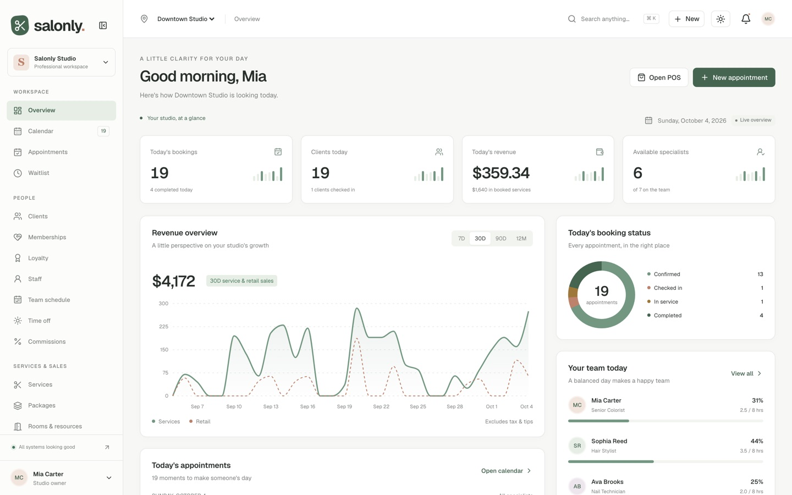

# Salonly Lite — free Next.js salon, spa & barber dashboard

**Bookings, clients, staff and revenue — beautifully organized.** A free, open-source admin dashboard for hair salons, barber shops, nail studios and spas, built with Next.js 16, React 19, TypeScript and Tailwind CSS v4.

**[Live demo of the full version →](https://salonly-iota.vercel.app)**



## What's in Lite

- **Studio dashboard:** KPIs, revenue overview, booking status, team utilization, today's appointments, top services, client insights, inventory alerts and live activity
- **Client directory:** TanStack Table with search, sorting, row selection, pagination and CSV export, plus an add-client form (React Hook Form + Zod)
- **Appointments list:** filter by status, specialist and date, with KPIs
- **App shell:** collapsible sidebar, mobile navigation, location switcher, command menu (⌘/Ctrl K), quick create, light/dark/system themes, toasts, loading skeletons, empty states, 404 and error pages
- **Demo sign-in screens** and typed, relational demo data (80 clients, about 100 appointments, 10 staff, 3 locations)

## Lite vs Pro

|                                                                           | Lite (free) | [Pro](https://salonly-iota.vercel.app) |
| ------------------------------------------------------------------------- | :---------: | :------------------------------------: |
| Dashboard, client directory, appointments list, app shell, dark mode      |      ✓      |                   ✓                    |
| Staff calendar: day / week / month / per-specialist views                 |             |                   ✓                    |
| Booking wizard with conflict detection, check-in → checkout workflow      |             |                   ✓                    |
| Client profiles with color formulas, timeline, loyalty and gift cards     |             |                   ✓                    |
| Point of sale: split payments, tips, gift cards, store credit, receipts   |             |                   ✓                    |
| Staff profiles, team schedule, time off, commissions                      |             |                   ✓                    |
| Services, packages, memberships, loyalty, rooms & resources               |             |                   ✓                    |
| Products, multi-location inventory, suppliers, purchase orders            |             |                   ✓                    |
| Invoices, payments, refunds, reviews, campaigns, messages, reports        |             |                   ✓                    |
| Settings (booking rules, taxes, deposits, notifications, integrations)    |             |                   ✓                    |
| Business logic with unit tests (checkout, conflicts, receiving stock)     |             |                   ✓                    |
| Documentation and email support                                           |             |                   ✓                    |
| License                                                                   |     MIT     |               Commercial               |

Pro screens appear in Lite's sidebar with a **PRO** badge and open a preview that links to the same screen in the live demo.

## Getting started

Requires Node.js 22.13+.

```bash
npm install
npm run dev
```

Open http://127.0.0.1:3000.

```bash
npm run build      # production build
npm run lint       # ESLint
npm run typecheck  # TypeScript
npm test           # unit tests
npm run test:e2e   # Playwright browser tests (run `npx playwright install chromium` first)
```

## Tech stack

Next.js 16 (App Router) · React 19 · TypeScript (strict) · Tailwind CSS v4 · Radix UI · Recharts · TanStack Table · React Hook Form · Zod · date-fns · next-themes · Lucide icons · Geist font

## Customizing

- **Colors and dark mode:** CSS custom properties at the top of `src/app/globals.css` (`:root` for light, `.dark` for dark)
- **Logo:** `Brand` in `src/components/ui/primitives.tsx` and `src/app/icon.svg`
- **Navigation:** `src/lib/navigation.ts`
- **Demo data:** typed records in `src/data/`, read through `useStudio()`; swap `src/lib/repository.ts` for your API

## License

MIT. See `LICENSE`. Third-party notices are in `THIRD_PARTY_NOTICES.md`.
